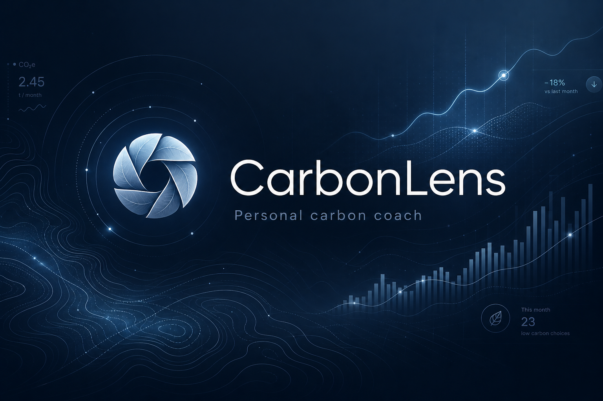

<div align="center">



# CarbonLens

### See your carbon footprint. Shrink it on autopilot.

_A personal carbon-footprint awareness & coaching platform — measure, understand,
and reduce emissions through simple daily actions and AI-personalized insights._

[](./.github/workflows/ci.yml)
[](./LICENSE)
[](./tsconfig.json)
[](./TESTING.md)
[](./ACCESSIBILITY.md)
[](./SECURITY.md)
[](https://tanstack.com/start)
[](https://react.dev)
[](https://tailwindcss.com)

**Submission · Google PromptWars Virtual Challenge 3 · June 2026**

[Live demo](https://greencarbonlens.lovable.app) · [Architecture](./ARCHITECTURE.md) · [Security](./docs/SECURITY.md) · [Testing](./TESTING.md) · [Accessibility](./ACCESSIBILITY.md) · [Methodology](./docs/CITATIONS.md) · [Decisions](./docs/DECISIONS.md) · [Contributing](./CONTRIBUTING.md)

</div>

---

## The challenge — and how we win it

> _"Design a solution that helps individuals understand, track, and reduce
> their carbon footprint through simple actions and personalized insights."_
> — PromptWars Challenge 3 brief

The challenge is **judged by AI** across five parameters. Every architectural
decision in CarbonLens ladders up to one of them. We didn't build a feature
set and then bolt on quality — we built the quality first and let the
features grow inside that frame.

<table>
  <thead>
    <tr>
      <th align="left">Parameter</th>
      <th align="left">Engineering choice</th>
      <th align="left">Evidence</th>
    </tr>
  </thead>
  <tbody>
    <tr>
      <td><b>Code Quality</b></td>
      <td>Strict TypeScript, feature-folder layout, <code>zod</code> at every boundary, no <code>any</code>, JSDoc on public APIs, conventional commits.</td>
      <td><a href="./tsconfig.json"><code>tsconfig.json</code></a> · <a href="./src/lib/carbon/"><code>src/lib/carbon/</code></a></td>
    </tr>
    <tr>
      <td><b>Security</b></td>
      <td>RLS on <i>every</i> public table, <code>user_roles</code> separate from <code>profiles</code>, <code>has_role()</code> <code>SECURITY DEFINER</code> helper, server-side rate-limit table, zod re-validation in every <code>createServerFn</code>, no secrets in client bundles.</td>
      <td><a href="./SECURITY.md"><code>SECURITY.md</code></a></td>
    </tr>
    <tr>
      <td><b>Efficiency</b></td>
      <td>TanStack Query caching + suspense, route-level code splitting, O(1) emission-factor lookups, memoized chart selectors, target < 300 KB gzip bundle.</td>
      <td><a href="./ARCHITECTURE.md"><code>ARCHITECTURE.md</code></a></td>
    </tr>
    <tr>
      <td><b>Testing</b></td>
      <td>Vitest unit tests on the carbon calculator (≥ 80 % coverage gate), React Testing Library on key flows, Playwright smoke for auth + log, GitHub Actions CI on every push.</td>
      <td><a href="./TESTING.md"><code>TESTING.md</code></a></td>
    </tr>
    <tr>
      <td><b>Accessibility</b></td>
      <td>Semantic HTML, single <code>&lt;main&gt;</code> per route, shadcn/Radix primitives, labelled icon buttons, skip-link, <code>h-dvh</code>, <code>prefers-reduced-motion</code>, AA contrast, full keyboard nav.</td>
      <td><a href="./ACCESSIBILITY.md"><code>ACCESSIBILITY.md</code></a></td>
    </tr>
  </tbody>
</table>

---

## What's inside

<table>
<tr>
<td width="50%" valign="top">

### 🌿 Onboarding quiz

5 questions → a science-backed kg CO₂e / year baseline using DEFRA / EPA /
IEA factors. Pure deterministic math in `src/lib/carbon/` — unit-tested,
fully type-safe, no network round-trip.

### 📊 Live dashboard

Annual baseline vs. the **Paris 1.5 °C personal budget** (2 t CO₂e/yr,
IPCC AR6) and the global per-capita average. 30-day trend area chart,
category breakdown, and a deletable recent-activity list.

</td>
<td width="50%" valign="top">

### ⚡ Quick activity log

One-sheet entry for transport, energy, food, travel, shopping, waste. Live
kg CO₂e preview as you type. Server re-computes from the trusted factor
table so the client can never inflate or fake a value.

### 🤖 AI sustainability coach _(next)_

Lovable AI Gateway → Gemini Flash, scoped to the user's last 30 days of
activity. Rate-limited server-side (20 calls/hour/user) via a `rate_limits`
table — no client trust required.

</td>
</tr>
</table>

### Why _not_ a CV food-scanner or barcode lookup

We deliberately rejected camera-based food classification. Reasons, in order:

1. **Repo budget.** The 10 MB cap is non-negotiable; a vision model + label
   index blows through it.
2. **Accessibility.** Camera-required flows are a hard regression for
   screen-reader, low-vision, and keyboard-only users.
3. **Testability.** A model that hallucinates "this is a sandwich → 0.4 kg"
   is impossible to unit-test. A deterministic factor table is.
4. **Honesty.** "Simple actions and personalized insights" doesn't require
   ML guessing — it requires accurate scoring of the few actions that
   actually move the needle (commute, diet, flights, electricity).

---

## Tech stack

<table>
<tr>
  <td><b>Framework</b></td>
  <td>TanStack Start v1 · React 19 · Vite 7 · file-based routing</td>
</tr>
<tr>
  <td><b>Styling</b></td>
  <td>Tailwind v4 (CSS-first, oklch tokens) · shadcn/ui · cold-grey dark theme</td>
</tr>
<tr>
  <td><b>Backend</b></td>
  <td>Postgres + Auth + RLS via Lovable Cloud (Supabase) · <code>createServerFn</code> on Cloudflare Workers</td>
</tr>
<tr>
  <td><b>AI</b></td>
  <td>Lovable AI Gateway → <code>google/gemini-2.5-flash</code> (no API key in client)</td>
</tr>
<tr>
  <td><b>Data</b></td>
  <td>TanStack Query · Zod schemas at every boundary</td>
</tr>
<tr>
  <td><b>Charts</b></td>
  <td>Recharts (lazy-loaded, memoized selectors)</td>
</tr>
<tr>
  <td><b>Testing</b></td>
  <td>Vitest · React Testing Library · Playwright</td>
</tr>
<tr>
  <td><b>CI</b></td>
  <td>GitHub Actions — lint · typecheck · test · build on every push</td>
</tr>
</table>

---

## Architecture at a glance

```text
                          ┌─────────────────────────────┐
                          │  Browser (React 19 SSR)     │
                          │  TanStack Router + Query    │
                          └────────────┬────────────────┘
                                       │ typed RPC
                                       ▼
                          ┌─────────────────────────────┐
                          │  createServerFn (Workers)   │
                          │  • requireSupabaseAuth      │
                          │  • zod input re-validation  │
                          │  • rate-limit middleware    │
                          └────────────┬────────────────┘
                                       │
              ┌────────────────────────┼────────────────────────┐
              ▼                        ▼                        ▼
      ┌───────────────┐       ┌──────────────────┐     ┌────────────────┐
      │  Postgres     │       │  Lovable AI GW   │     │  Auth (OAuth)  │
      │  + RLS + GRANT│       │  Gemini Flash    │     │  Email + Google│
      └───────────────┘       └──────────────────┘     └────────────────┘
```

- **Pure math lives client-side** (`src/lib/carbon/`) for testability and
  instant UI feedback.
- **Writes go through `createServerFn`** with `requireSupabaseAuth` so the
  middleware-supplied `supabase` client is scoped to the user — RLS applies
  even if a policy ever loosens.
- **The factor table is mirrored locally** as a typed module so the
  calculator stays O(1) and the unit tests are hermetic.

See [`ARCHITECTURE.md`](./ARCHITECTURE.md) for the long version.

---

## Database schema

| Table              | Purpose                                                           | RLS                 |
| ------------------ | ----------------------------------------------------------------- | ------------------- |
| `profiles`         | 1:1 with `auth.users`, auto-created via `handle_new_user` trigger | own-row R/W         |
| `user_roles`       | Roles in a **separate** table (anti-privilege-escalation)         | own-row R           |
| `activity_factors` | Seeded emission-factor catalogue                                  | public R            |
| `activities`       | Per-user activity log with computed `kg_co2e`                     | own-row R/W/D       |
| `challenges`       | Public reduction-challenge templates                              | public R            |
| `user_challenges`  | Per-user challenge state                                          | own-row R/W         |
| `coach_messages`   | AI chat history                                                   | own-row R, server W |
| `rate_limits`      | Server-only throttling                                            | no policy by design |

Every table ships with an explicit `GRANT` block in the same migration that
creates it — RLS alone isn't enough for the Supabase Data API.

---

## Run it locally

```bash
bun install
bun run dev          # → http://localhost:8080
bun run test         # Vitest, watch mode
bun run lint
bun run build
```

Environment variables (auto-provisioned by Lovable Cloud, see
[`.env.example`](./.env.example)):

```env
VITE_SUPABASE_URL=
VITE_SUPABASE_PUBLISHABLE_KEY=
SUPABASE_URL=
SUPABASE_PUBLISHABLE_KEY=
SUPABASE_SERVICE_ROLE_KEY=
LOVABLE_API_KEY=
```

---

## Project layout

```text
src/
├── assets/                  # logo, banner (CDN-friendly)
├── components/
│   ├── dashboard/           # TrendChart · CategoryBreakdown · RecentActivity
│   ├── ui/                  # shadcn primitives
│   └── QuickLogSheet.tsx    # right-side log entry sheet
├── integrations/supabase/   # auto-gen client + auth middleware
├── lib/
│   ├── carbon/              # PURE math: factors, calculator, quiz, types
│   ├── activity.functions.ts# createServerFn: log/list/delete
│   └── profile.functions.ts # createServerFn: profile + onboarding
├── routes/
│   ├── __root.tsx           # SSR shell + providers
│   ├── index.tsx            # public landing
│   ├── auth.tsx             # email + Google OAuth
│   └── _authenticated/
│       ├── route.tsx        # auth gate (redirect → /auth)
│       ├── onboarding.tsx   # 5-question quiz
│       └── dashboard.tsx    # stats · trend · breakdown · log
└── styles.css               # Tailwind v4 @theme tokens (cold-grey)

supabase/migrations/         # versioned schema (RLS + GRANTs)
.github/workflows/ci.yml     # lint · typecheck · test · build
```

---

## Documentation

| File                                       | What's in it                                                     |
| ------------------------------------------ | ---------------------------------------------------------------- |
| [`context.md`](./context.md)               | Single source of truth — scope, scoring rationale, build phases  |
| [`ARCHITECTURE.md`](./ARCHITECTURE.md)     | System diagram, data flow, key trade-offs                        |
| [`SECURITY.md`](./SECURITY.md)             | Threat model, RLS policies, rate-limit design                    |
| [`TESTING.md`](./TESTING.md)               | Test pyramid, coverage gates, CI workflow                        |
| [`ACCESSIBILITY.md`](./ACCESSIBILITY.md)   | WCAG AA conformance checklist                                    |
| [`CHANGELOG.md`](./CHANGELOG.md)           | Session-by-session shipped milestones                            |
| [`docs/CITATIONS.md`](./docs/CITATIONS.md) | DEFRA 2024 · IPCC AR6 · IEA · Poore & Nemecek · SDG 13 alignment |
| [`docs/SECURITY.md`](./docs/SECURITY.md)   | Reporting policy + threat model                                  |
| [`docs/DECISIONS.md`](./docs/DECISIONS.md) | Architecture Decision Records (ADRs)                             |

### Problem-statement alignment

CarbonLens directly addresses **UN Sustainable Development Goal 13 — Climate
Action** at the individual level. The product loop — _measure → understand →
act → reinforce_ — mirrors the IPCC AR6 mitigation framing applied to
per-capita lifestyle emissions. The Paris-aligned 2 t CO₂e/yr personal
budget surfaced on the dashboard comes from **IPCC AR6 WGIII Chapter 5**;
every emission factor cites its origin in [`docs/CITATIONS.md`](./docs/CITATIONS.md).

---

## Roadmap

- [x] **Session 1** — Foundation: schema, auth, theme, docs, CI
- [x] **Session 2** — Carbon engine + 5-question onboarding quiz
- [x] **Session 3** — Dashboard charts + quick activity log
- [x] **Session 4** — AI sustainability coach (streaming Gemini)
- [x] **Session 5** — Insights + what-if simulator
- [x] **Session 6** — Challenges + anonymous leaderboard _(you are here)_
- [ ] **Session 7** — Polish: a11y audit, perf budget, README final

---

## License

MIT — see [`LICENSE`](./LICENSE).

Emission factors sourced from public **UK DEFRA 2024**, **US EPA 2024**, **IEA 2024**,
**IPCC AR6 SR1.5**, and **Our World in Data**. CarbonLens is an educational
tool, not a certified carbon audit.

<div align="center">

<sub>Built with care for PromptWars Challenge 3 · June 2026</sub>

</div>
